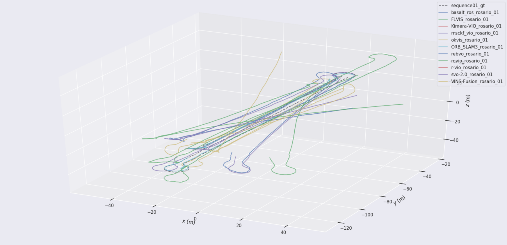

This repository contains different state-of-the-art VIO systems that were evaluated in an agricultural environment by means of the [Rosario Dataset](https://www.cifasis-conicet.gov.ar/robot). As an example, some outputs regarding the sequence01 can be seen here:



# Video
There is also a video that accompanies this publication, available [here](https://youtu.be/H6dWhKUqfJA).

# Publication

If you use this in some academic work, please cite the related publication:

J. Cremona, R. Comelli, T. Pire, **Experimental evaluation of Visual-Inertial Odometry systems for arable farming**. Journal of Field Robotics, 2022. DOI: https://doi.org/10.1002/rob.22099
 
```bibtex
@article{cifasis2022evaluation,
 author = {Cremona, Javier and Comelli, Rom{\'a}n and Pire, Taih{\'u}},
 title = {Experimental evaluation of Visual-Inertial Odometry systems for arable farming},
 journal = {Journal of Field Robotics},
 volume = {39},
 number = {7},
 pages = {1121--1135},
 keywords = {agricultural robotics, precision agriculture, SLAM, Visual-Inertial Odometry},
 year = {2022},
 doi = {https://doi.org/10.1002/rob.22099},
 url = {https://onlinelibrary.wiley.com/doi/abs/10.1002/rob.22099},
 eprint = {https://onlinelibrary.wiley.com/doi/pdf/10.1002/rob.22099}
}
```

# Context

As stated above, this repository has several VIO pipelines that were assessed as part of the aforementioned publication. Through the provided scripts and containerized submodules, it allows to repeat the tests done in a systematic and simple way (clearly the results could vary up to some point, depending on the hardware platform and due to the random nature of some algorithms internally used by the systems).

The repository is also intended to serve as a base for further progress in the development of more accurate and robust VIO and SLAM systems, specially for the agricultural environment. Modifying the source code of the already included submodules or adding and comparing other systems is what we expect and encourage the academic community to do.

# Dependencies

It is necessary to have installed:

* Docker
* ROS (with rviz)
* [pose_listener](https://github.com/CIFASIS/pose_listener)

It was everything tested in Ubuntu 16.04, 18.04 and 20.04. We suggest to follow [the steps](https://docs.docker.com/engine/install/linux-postinstall/#manage-docker-as-a-non-root-user) to manage Docker as a non-root user to make it easier to run the scripts. With respect to the ROS versions, Kinetic, Melodic and Noetic have been used with their respective Ubuntu's versions. pose_listener is a simple ROS node developed to capture the systems' outputs.

We also recommend to have [evo](https://github.com/MichaelGrupp/evo) installed in order to visualize and calculate the errors of the estimated trajectories.

# Use

To clone the repository, execute this:

```bash
git clone git@github.com:CIFASIS/slam_agricultural_evaluation.git
cd slam_agricultural_evaluation
git submodule update --init --recursive
```

Once this is done (it may take some time), we are ready to build the images and download the Rosario Dataset rosbags. For this and the rest of the things that can be done, the `evaluation.config` file is provided. It defines which modules will be taken into account when building or launching the containers, what sequences will be used (and where they are), where the local catkin workspace will be and the ROS version used, among other things.

So, to download all the sequences and store them in `${HOME}/datasets/robot_desmalezador` (default), just run:

```bash
./download_rosbags.sh
```

Of course, it could be omitted if the rosbags were downloaded previously. It would be enough to set their location in `evaluation.config`. To build the images of the different systems (this may take more time), execute:

```bash
./build_images.sh
```

Then, if a local ROS workspace with pose_listener installed is missing, we provide `create_workspace.sh` to make it in the repository directory. Just execute:

```bash
./create_workspace.sh
```

Otherwise, the path to that local ROS workspace should be set in `evaluation.config`. And finally, the tests can be done (and redone) by running:

```bash
./run_containers.sh
```

The outputs of the systems will be saved in the `outputs/` directory of each submodule, with a script to plot the results (using evo).

# Development

To ease the development, each submodule has some scripts (used by the scripts located in the root of this repository) that allow to build the Docker images and run the systems in visualization or development modes. Their `README.md`s explain this.

# TODO

* `run_rosario_sequence.sh` fails when `rostopic list $TOPIC 2> /dev/null` returns more than one result (e.g. `/odometry  /odometry/gps`)
* When ORB-SLAM3 is launched in DEV mode (`run.sh -d`), it cannot be neither executed nor re-built, because `build` is hidden when `docker run -v <HOST_ORB_SLAM3_DIR>:<CONTAINER_ORB_SLAM3_DIR>` is executed.
* When DEV mode is launched `build.sh` should be a soft link to `<VIO_METHOD_ROOT>/scripts/build.sh`. This would allow to modify `scripts/build.sh` in the host.
